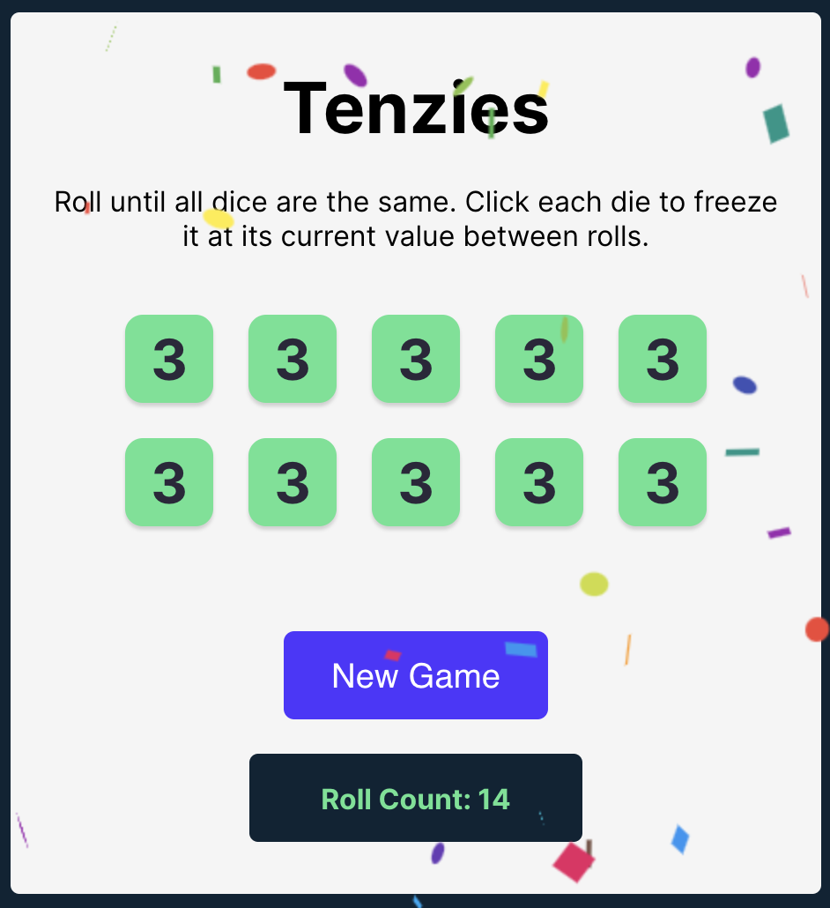

# Tenzies

## Description
- Tenzies is an app that is a dice game played with ten dice. The objective of the game is simple - the player needs to roll the dice and try to get all ten to show the same number.
- Upon launching the game, ten dice are rolled initially, each showing a random number from one to six. After each roll, the player can choose to 'hold' any number of dice, freezing them at their current values.
- Once a die is held, its value won't change in subsequent rolls. The player continues to roll the remaining unheld dice until all display the same number.
- The game features a button that lets you roll the dice with one click. The button's label changes to 'New Game' when you win—that is, when all ten dice show the same number.
- One unique feature of Tenzies is that it keeps track of the number of rolls taken to win a game.

### Technologies

### Deployment / Hosting

### Credits

[Scrimba](https://scrimba.com) Frontend Career Path  - Basic React

### Extra Credit
- CSS: put real dots on the dice.
- Track the number of Rolls - (Complete)
- Track the time it took to win
- Save the best time to localStorage
